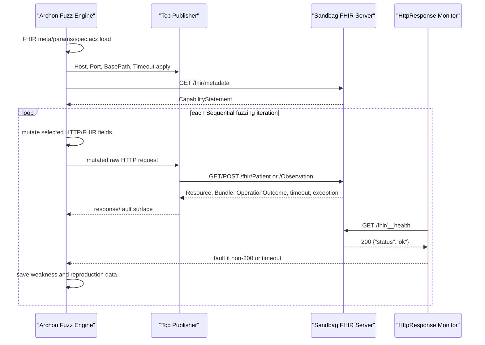

# Archon HL7 FHIR MVP implementation plan

이 문서는 Archon에서 Sandbag FHIR 서버를 실제 fuzzing target으로 붙이기 위한 1차 개발 확정안이다. 범위는 HL7 FHIR R4 REST/JSON 기준의 최소 실행 패키지이며, SMART/OAuth, TLS, XML/RDF, batch/transaction, history, terminology/profile validation은 2차로 둔다.

## 1. 최종 결정

| 항목 | 1차 확정값 | 근거 |
|---|---|---|
| Archon package path | `C:\Users\vip\suresoft\Archon\prebuilt\attacks\ethernet\fhir` | Archon `FindProtocolSpecFilePath()`가 `prebuilt/attacks` 하위 `meta.json`의 `Name`으로 `spec.acz`를 찾음. |
| LinkLayer | `TCP` | FHIR REST는 `http{s}://server{/path}` Service Base URL을 기준으로 하며, Archon은 `TCP` LinkLayer를 `Tcp` Publisher로 매핑함. |
| Publisher | `Tcp` | 기존 HTTP package와 동일한 raw HTTP-over-TCP 구조. |
| PIT args handler | `PitArgsHandlerFactory`에 `FHIR` 등록 | `params.json` 기반 `##Key##` 치환이 실제 Archon 실행/reproduction 경로에서 동작해야 함. |
| Interface/NIC param | 노출하지 않음 | `TcpClientPublisher`는 `Interface`가 없거나 `Default`이면 bind 없이 일반 `TcpClient`를 사용함. |
| ConnectionTest | `GET {BasePath}/metadata` | FHIR REST capabilities interaction은 `GET [base]/metadata`이며 서버가 지원해야 하는 interaction. |
| Health monitor | `HttpResponse` -> `http://{Host}:{Port}{BasePath}{HealthPath}` | `/__health`는 FHIR 표준 endpoint가 아니라 Sandbag 생존 확인용 oracle. |
| Strategy | `Sequential` | 기존 HTTP/HTTPS/ISO/DIN/DoIP prebuilt test 관례와 동일. |
| Timeout | `3000` ms | FHIR 표준값이 아니라 Archon `HttpResponseMonitor`와 `Tcp` publisher의 기본 timeout. |
| BasePath | `/fhir` | Sandbag FHIR service 기본 endpoint. |
| Accept/Content-Type | `application/fhir+json` | FHIR JSON MIME type. |

## 2. Sequence flow



## 3. What is fuzzed in MVP

| Test | Seed request | Mutated surface |
|---|---|---|
| `ConnectionTest` | `GET /fhir/metadata` | No mutation. Read-only connection check. |
| `FhirMetadataFormatTest` | `GET /fhir/metadata?_format=json` | `_format`, `Accept`. |
| `FhirPatientReadIdTest` | `GET /fhir/{ResourceType}/{ResourceId}` | `ResourceType`, `ResourceId`, `Accept`. |
| `FhirPatientSearchNameTest` | `GET /fhir/{ResourceType}?name=Kim` | `ResourceType`, `name`, `Accept`. |
| `FhirPatientCreateTest` | `POST /fhir/Patient` | `Content-Type`, `Accept`, `resourceType`, `identifier`, `name`, `gender`, `birthDate`, `active`. |
| `FhirObservationCreateTest` | `POST /fhir/Observation` | `Content-Type`, `Accept`, `resourceType`, `status`, `code`, `subject.reference`, `valueQuantity`. |

`Patient.age`는 FHIR Patient resource의 직접 필드가 아니다. 나이 조건은 Observation의 `referenceRange.age` 같은 nested 요소에 나타날 수 있으므로, 1차에서는 `birthDate`를 fuzzing하고 age 관련 semantic fuzzing은 2차 profile/semantic validator 단계로 둔다.

## 4. Connection test 기준

1차 Archon package의 connection test는 상태를 바꾸지 않는 `GET {BasePath}/metadata`만 수행한다.

Pass 기준:

- TCP 연결이 성립한다.
- HTTP 응답이 수신된다.
- 응답 body에 Sandbag 기준 `CapabilityStatement`, `fhirVersion":"4.0.1`, `Patient`, `Observation` token이 존재한다.

`/__health`는 connection test가 아니라 monitor에만 쓴다. 이유는 FHIR 표준 endpoint가 아니기 때문이다. POST/PUT seed 생성도 connection test에서 제외한다. 이유는 상태 변경이 발생하고, connection test가 seed data 존재 여부에 묶이면 실제 서버 적용성이 떨어지기 때문이다.

## 5. Monitor and NIC runbook

FHIR package는 `Agent`에 `HttpResponse` monitor를 내장한다.

```xml
<Monitor class="HttpResponse">
  <Param name="Url" value="http://##Host##:##Port####BasePath####HealthPath##"/>
  <Param name="Method" value="Get"/>
  <Param name="Timeout" value="##Timeout##"/>
</Monitor>
```

권장 capture 방식:

| 실행 위치 | Wireshark/NIC | Display filter |
|---|---|---|
| Archon과 Sandbag이 같은 Windows host | `Npcap Loopback Adapter` | `tcp.port == 8080` 또는 `http` |
| Sandbag이 WSL/Docker | 해당 `vEthernet`/NAT adapter 또는 host-reachable IP adapter | `tcp.port == 8080` |
| Sandbag이 다른 PC/VM | 물리 NIC 또는 VM bridge/NAT adapter | `tcp.port == 8080 && ip.addr == <sandbag-ip>` |
| HTTPS 2차 | TLS key log/proxy 없이는 payload 확인 불가 | transport 중심 확인 |

1차에서는 `Interface`를 FHIR params에 노출하지 않는다. Archon의 `Tcp` publisher는 `Interface` 값이 없거나 `Default`일 때 OS routing에 맡기므로, same-host/localhost 실행에 더 단순하다.

## 6. Execution checklist

1. Sandbag FHIR server 실행:

```powershell
python main.py --protocol fhir --host 127.0.0.1 --port 8080 --base-path /fhir
```

2. Sandbag 자체 검증:

```powershell
python test_fhir_verify.py --base-url http://127.0.0.1:8080/fhir
```

3. Archon에서 FHIR protocol 선택:

```text
Protocol: FHIR
Host: 127.0.0.1
Port: 8080
BasePath: /fhir
ConnectionTestPath: /metadata
HealthPath: /__health
ResourceType: Patient
ResourceId: example
Accept: application/fhir+json
ContentType: application/fhir+json
Timeout: 3000
```

4. Connection Test 실행: `GET /fhir/metadata`가 성공해야 한다.
5. Wireshark에서 adapter/filter 선택 후 fuzzing 시작.
6. Fault가 나오면 Archon reproduction data와 Sandbag log, packet capture를 함께 확인한다.

## 7. Implemented files

Archon:

- `C:\Users\vip\suresoft\Archon\prebuilt\attacks\ethernet\fhir\meta.json`
- `C:\Users\vip\suresoft\Archon\prebuilt\attacks\ethernet\fhir\params.json`
- `C:\Users\vip\suresoft\Archon\prebuilt\attacks\ethernet\fhir\spec.acz`
- `C:\Users\vip\suresoft\Archon\ArchonCore\PitArgsHandlerFactory.cs`
- `C:\Users\vip\suresoft\Archon\Test\Core\Publishers\FhirPackageTests.cs`

ArchonZ-Sandbag:

- `docs/hl7-fhir/archon-fhir-mvp-implementation-plan.md`

## 8. Verification status

Completed:

- `meta.json`/`params.json` JSON parse.
- `spec.acz` XML parse.
- 6 tests found: `ConnectionTest`, `FhirMetadataFormatTest`, `FhirPatientReadIdTest`, `FhirPatientSearchNameTest`, `FhirPatientCreateTest`, `FhirObservationCreateTest`.
- All 6 tests use `Strategy class="Sequential"`.
- All 6 tests use `Publisher class="Tcp"`.
- Built-in `HttpResponse` monitor count is 1.
- `Interface` param count is 0.
- All `##Key##` placeholders are present in `params.json`.
- `python test_fhir_verify.py` passed all 4 Sandbag FHIR verification cases.

Blocked:

- `dotnet test Test\Core\ArchonCoreTest.csproj --filter FullyQualifiedName~FhirPackageTests` did not reach test execution in this workspace because the current restore/build environment cannot resolve existing repo dependencies such as `NLog`, `ZSpitz`, `IronPython`, `SharpPcap`, and `System.IO.Ports`. A prior `--no-restore` run compiled to `ArchonCoreTest.dll` but the testhost then failed on missing `NuGet.Frameworks.dll`.

## 9. Deferred to 2nd phase

- HTTPS/TLS, certificate policy, TLS payload capture.
- SMART/OAuth authorization flow.
- FHIR XML/RDF serialization.
- FHIR batch/transaction/history/conditional interactions.
- OperationOutcome severity/code semantic oracle.
- CapabilityStatement 기반 동적 test generation.
- Full FHIR profile/terminology validator.
- `POST _search`, invalid method/content-type/JSON negative matrix.

## 10. Source locations used

HL7 FHIR R4:

- `docs/hl7-fhir/raw/R4/http.html`: Service Base URL `http{s}://server{/path}` around lines 230-237.
- `docs/hl7-fhir/raw/R4/http.html`: HTTPS/security guidance around lines 310-311.
- `docs/hl7-fhir/raw/R4/http.html`: FHIR MIME types around lines 405-410.
- `docs/hl7-fhir/raw/R4/http.html`: capabilities interaction `GET [base]/metadata` around lines 1217-1228; required server support around line 1262.
- `docs/hl7-fhir/raw/R4/json.html`: JSON `resourceType`, no null/empty, arrays for repeating elements around lines 192-203 and 407-421.
- `docs/hl7-fhir/raw/R4/patient.html`: Patient fields including identifier/name/gender/birthDate around lines 189-199.
- `docs/hl7-fhir/raw/R4/observation.html`: Observation fields including status/code/subject/valueQuantity around lines 881-896.

Archon:

- `C:\Users\vip\suresoft\Archon\ArchonCore\PitUtilities.cs`: `TCP` -> `Tcp` publisher mapping around lines 109-121 and 331-348; monitor list around lines 187-195.
- `C:\Users\vip\suresoft\Archon\ArchonCore\Publishers\TcpClientPublisher.cs`: `Host`, `Port`, `Interface`, `Timeout` defaults around lines 31-46; no/default Interface binding behavior around lines 91-106.
- `C:\Users\vip\suresoft\Archon\ArchonCore\Agent\Monitors\HttpResponseMonitor.cs`: monitor params and 200-only success behavior around lines 15-19 and 37-88.
- `C:\Users\vip\suresoft\Archon\ArchonCore\PitMaker.cs`: connection test creation and test augmentation around lines 48-129 and 329-418.
- `C:\Users\vip\suresoft\Archon\ArchonCore\Analyzers\PitParser.cs`: `##Key##` define replacement around lines 270-285; `ConnectionTest` removal from normal fuzzing analysis around lines 184-192.
- `C:\Users\vip\suresoft\Archon\ArchonCore\PitArgsHandlerFactory.cs`: generic params handler cases around lines 18-29 and params-file lookup around lines 145-162.

Sandbag:

- `README.md`: FHIR default endpoint/resources/content type around lines 343-350; standalone verify commands around lines 352-373.
- `docs/hl7-fhir/fhir-sandbag-usage.md`: supported endpoints around lines 47-62; MVP limits around lines 160-166.
- `services/fhir_service.py`: supported resource types and seed fields around lines 16-68; body/content type validation around lines 464-495; compact JSON response generation around lines 574-586.
