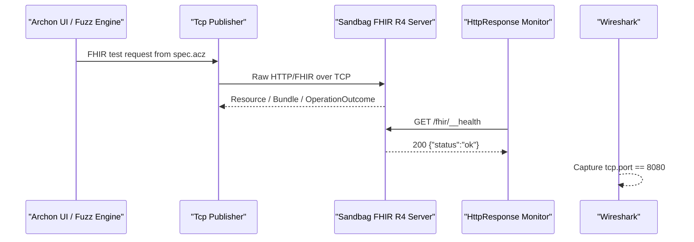

# FHIR MVP final checklist

## 1. 1차 Sandbag MVP status

| Item | Status | Note |
|---|---|---|
| FHIR standard baseline | Done | HL7 FHIR R4, `fhirVersion=4.0.1` |
| Sandbag FHIR target | Done | `Patient`, `Observation`, `CapabilityStatement`, `OperationOutcome` |
| Archon protocol package | Done | `prebuilt/attacks/ethernet/fhir` |
| Archon PIT args handler | Done | `FHIR` registered in `PitArgsHandlerFactory` |
| Connection test design | Done | `GET {BasePath}/metadata` |
| Monitor design | Done | `HttpResponse` monitor to `{BasePath}{HealthPath}` |
| NIC policy | Done | Same-host execution uses `Interface=Default` |
| Packet capture policy | Done | Wireshark, `Npcap Loopback Adapter`, `tcp.port == 8080` |
| Real Archon UI smoke test | Pending | Run Archon UI and execute connection/fuzzing |

Conclusion: 1차 implementation/documentation MVP is complete. Final acceptance needs Archon UI smoke test evidence.

## 1-2. 2차 HAPI target MVP status

| Item | Status | Note |
|---|---|---|
| Local HAPI FHIR R4 target plan | Done | See `hapi-r4-target-mvp.md` |
| External target verifier | Done | `test_fhir_target_verify.py` |
| HAPI monitor policy | Done | Use `HealthPath=/metadata`, not `/__health` |
| HAPI Swagger/OpenAPI check | Done | `/fhir/api-docs`, `/fhir/swagger-ui/` |
| Docker runtime validation | Environment blocked | Current Windows PATH has no `docker` command |

## 2. Why R4, not DSTU2

| Decision point | R4 | DSTU2 |
|---|---|---|
| Current project baseline | Selected | Not selected |
| FHIR version | `4.0.1` | `1.0.x` |
| Metadata response | `CapabilityStatement` | Usually `Conformance` |
| MIME type | `application/fhir+json` | Older `application/json+fhir` style may appear |
| Open-source target fit | HAPI FHIR R4 is a better fit | MITRE `fhir-server` is legacy DSTU2 |
| Archon MVP compatibility | Directly compatible | Requires separate legacy package |

DSTU2 can be used later as a legacy compatibility target, but the MVP should remain R4.

## 3. Runtime topology



## 4. Sandbag command

```powershell
cd C:\Users\vip\suresoft\ArchonZ-Sandbag
python main.py --fhir_only --fhir_host 0.0.0.0 --fhir_port 8080 --fhir_base_path /fhir
```

Expected log examples:

```text
GET /fhir/__health HTTP/1.1" 200
GET /fhir/metadata HTTP/1.1" 200
GET /fhir/Patient/example HTTP/1.1" 200
POST /fhir/Patient HTTP/1.1" 201
POST /fhir/Observation HTTP/1.1" 201
```

## 5. Archon UI settings

### NIC setting

| Field | Value |
|---|---|
| Host | `127.0.0.1` |
| Port | `8080` |
| Interface | `Default` |
| Url | `/` |
| RetryMode | `FirstAndAfterFault` |
| FaultOnConnectionFailure | `True` |
| Lifetime | `Iteration` |
| Timeout | `3000` |
| SendTimeout | `5000` |
| ConnectTimeout | `10000` |

`Interface=Default` is correct for same-host `127.0.0.1` testing. Do not bind to a physical NIC for this MVP run.

### FHIR params

| Field | Value |
|---|---|
| BasePath | `/fhir` |
| ConnectionTestPath | `/metadata` |
| HealthPath | `/__health` |
| ResourceType | `Patient` |
| ResourceId | `example` |
| Accept | `application/fhir+json` |
| ContentType | `application/fhir+json` |
| Timeout | `3000` |

### Monitor

| Field | Value |
|---|---|
| Monitor | `Http Response Monitor` |
| Url | `http://127.0.0.1:8080/fhir/__health` |
| Method | `Get` |
| Timeout | `3000` |
| Content | empty |

If the UI does not require adding a monitor manually, use the built-in monitor from the FHIR package.

### HAPI R4 target override

When targeting local HAPI FHIR R4 instead of Sandbag:

| Field | Value |
|---|---|
| Host | `127.0.0.1` |
| Port | `8090` |
| BasePath | `/fhir` |
| ConnectionTestPath | `/metadata` |
| HealthPath | `/metadata` |
| Monitor URL | `http://127.0.0.1:8090/fhir/metadata` |
| Timeout | `10000` |

Do not use `/__health` for HAPI. It is a Sandbag-only convenience endpoint.

## 6. Attack sequence in MVP

| Test | Request | Primary fuzzing field |
|---|---|---|
| `ConnectionTest` | `GET /fhir/metadata` | No fuzzing |
| `FhirMetadataFormatTest` | `GET /fhir/metadata?_format=json` | `_format`, `Accept` |
| `FhirPatientReadIdTest` | `GET /fhir/Patient/example` | `ResourceType`, `ResourceId`, `Accept` |
| `FhirPatientSearchNameTest` | `GET /fhir/Patient?name=Kim` | `ResourceType`, `name`, `Accept` |
| `FhirPatientCreateTest` | `POST /fhir/Patient` | Patient JSON body/header |
| `FhirObservationCreateTest` | `POST /fhir/Observation` | Observation JSON body/header |

## 7. Wireshark check

Adapter:

```text
Npcap Loopback Adapter
```

Display filters:

```text
tcp.port == 8080
```

```text
tcp.port == 8080 && http
```

For metadata requests:

```text
tcp.port == 8080 && http.request.uri contains "/fhir/metadata"
```

If HTTP parsing breaks because of mutated data:

```text
tcp.port == 8080 && frame contains "GET /fhir/metadata"
```

```text
tcp.port == 8080 && frame contains "Accept:"
```

For `FhirMetadataFormatTest -> Request-MetadataFormat -> Accept`, use `Follow > TCP Stream` and verify:

```http
GET /fhir/metadata?_format=<mutated-value> HTTP/1.1
Host: 127.0.0.1:8080
Accept: <mutated-value>
Connection: close
```

## 8. Acceptance criteria

The MVP is accepted when all of the following are true:

| Check | Pass condition |
|---|---|
| FHIR appears in Archon UI | Protocol list includes `FHIR` |
| Connection test | Sandbag logs `GET /fhir/metadata` with HTTP 200 |
| Fuzzing request | Sandbag receives at least one FHIR fuzzing request |
| Monitor | Sandbag logs `GET /fhir/__health` with HTTP 200 |
| Packet capture | Wireshark captures `tcp.port == 8080` traffic |
| Mutated value evidence | TCP stream shows changed target field, such as `Accept` |
| Fault handling | Non-200, timeout, or server failure is recorded as fault |

## 9. Known limits

- Plain HTTP/TCP only; HTTPS/TLS is deferred.
- Sandbag-specific health endpoint `/__health` is not a FHIR standard endpoint.
- No SMART/OAuth.
- No XML/RDF.
- No batch/transaction/history/conditional interactions.
- No full profile/terminology validator.
- MITRE DSTU2 is a future legacy target check, not an MVP blocker.
- SMART-EHR-Launcher and `smart-launcher-v2` proxy are 3차 scope, not 2차 HAPI direct target scope.

## 10. Evidence to capture for final report

Capture these five screenshots/log snippets:

1. Archon UI showing `FHIR` selected.
2. Archon connection test result.
3. Sandbag log showing `GET /fhir/metadata` 200.
4. Wireshark TCP stream showing mutated `Accept` or body field.
5. Archon result/fault screen after fuzzing run.

Once these are captured, the MVP can be marked as end-to-end verified.
